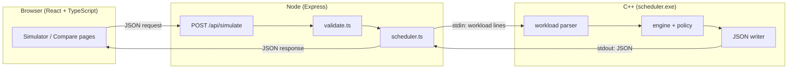

# Architecture overview

Three layers. The C++ does the work; everything else is presentation.

The same binary backs the terminal and the browser, so the two can never
disagree. Every number shown in the web interface has been checked against the
CLI output for the same workload.

## Why C++ is not just a library call

Node talks to the scheduler by **running it as a program** and piping a workload
into its standard input. Not a native addon, not a shared library, not a
rewrite - a process.

That is deliberate:

- The C++ is genuinely standalone. It works with no JavaScript anywhere near it,
  which matters when the point of the project is the C++.
- The boundary is a text format and a JSON document, both readable by a human
  when something goes wrong.
- Nothing needs recompiling when the web layer changes.

The cost is process spawn overhead per request - irrelevant here, where a
simulation takes microseconds.

## The layers

### `core/` - the scheduling logic

No input, no output, no dependencies beyond the standard library. Given a
workload and a policy, it produces a timeline and metrics. Everything else is
built on this.

Compiled as a library (`scheduler_core`) rather than being part of the
executable, so the test suite links against exactly the code that ships.

See [the engine](the-engine.md) and [scheduling policies](scheduling-policies.md).

### `cli/` - the command line program

Argument parsing, workload file parsing, and rendering - text or JSON. Also
built as a library (`scheduler_cli`) so its parsers can be tested directly
rather than through the program's output.

`main.cpp` is only wiring: read arguments, read a workload, run, print.

### `frontend/` - the web interface

- `frontend/server/` - Express. Validates the request, runs the binary, returns
  its output.
- `frontend/src/` - React and TypeScript. Two pages, a Gantt chart, tables and a
  comparison chart.

See the [JSON contract](json-contract.md) for the shape passed between them.

## What a request does

1. The browser POSTs a workload and settings to `/api/simulate`.
2. `validate.ts` checks it and collects **every** problem, not just the first.
   Process ids are restricted to `[A-Za-z0-9_-]{1,16}` because they become
   whitespace-separated fields in the text format - an id with a space in it
   would silently become two fields.
3. `scheduler.ts` finds the binary and spawns it with `--format json`, writing
   the workload to stdin.
4. The C++ parses, simulates and prints JSON.
5. Node parses that and returns it.

Every failure along the way resolves into an error response rather than
throwing: a missing binary, a crash, a timeout, or a flood of output. The server
never falls over because a child process misbehaved.

## Layering rules

- `core/` knows nothing about files, arguments, JSON or HTTP.
- `cli/` depends on `core/`, never the reverse.
- The web server knows only the CLI's public interface: its flags and its JSON.
- A scheduling policy can only *read* engine state - see
  [scheduling policies](scheduling-policies.md).

These are what let the pieces be tested separately, and what stop a bug in one
layer becoming a bug in another.

## What is deliberately absent

No database, no ORM, no authentication, no session store, no component library.
A simulator has nothing to persist and no users to tell apart. Each of those
would be a dependency to install, a failure mode to handle, and a thing to
explain, in exchange for nothing.
